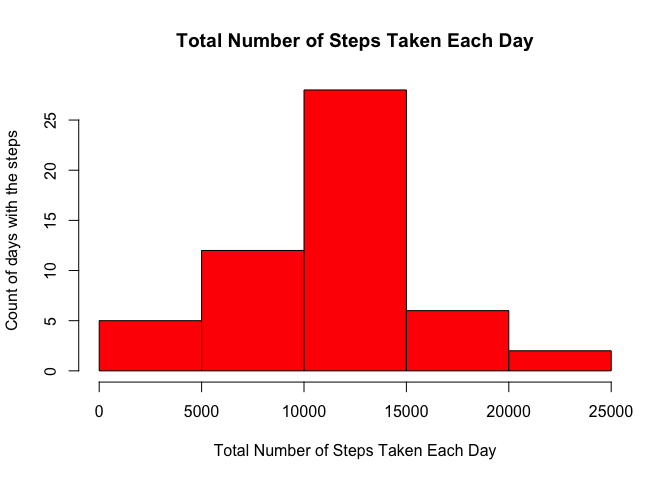
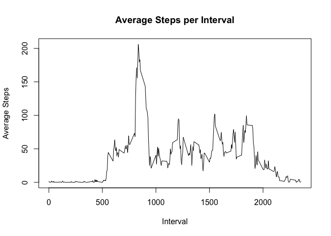
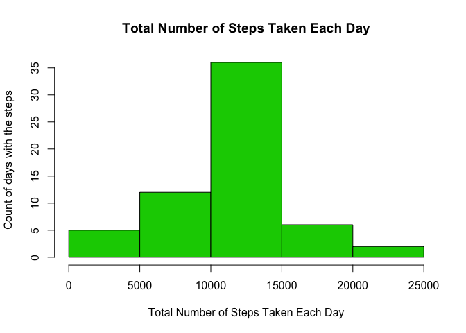
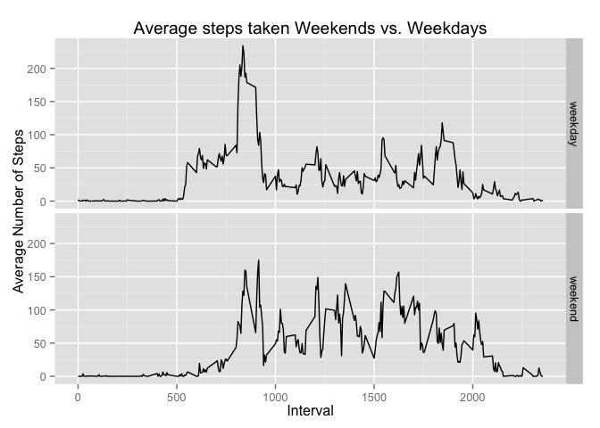

# Reproducible Research: Peer Assessment 1


## Loading and preprocessing the data

Read the csv file 'activity.csv' into a dataset called activityfile


```r
activityzip <- unzip("activity.zip")

activityfile <- read.csv(activityzip)
```


Analyze the dataset with summary, names and str commands


```r
names(activityfile)
```

```
## [1] "steps"    "date"     "interval"
```

```r
str(activityfile)
```

```
## 'data.frame':	17568 obs. of  3 variables:
##  $ steps   : int  NA NA NA NA NA NA NA NA NA NA ...
##  $ date    : Factor w/ 61 levels "2012-10-01","2012-10-02",..: 1 1 1 1 1 1 1 1 1 1 ...
##  $ interval: int  0 5 10 15 20 25 30 35 40 45 ...
```

```r
summary(activityfile)
```

```
##      steps                date          interval     
##  Min.   :  0.00   2012-10-01:  288   Min.   :   0.0  
##  1st Qu.:  0.00   2012-10-02:  288   1st Qu.: 588.8  
##  Median :  0.00   2012-10-03:  288   Median :1177.5  
##  Mean   : 37.38   2012-10-04:  288   Mean   :1177.5  
##  3rd Qu.: 12.00   2012-10-05:  288   3rd Qu.:1766.2  
##  Max.   :806.00   2012-10-06:  288   Max.   :2355.0  
##  NA's   :2304     (Other)   :15840
```


Remove rows with NA values and copy to a new dataset called data


```r
data <- na.omit(activityfile)
```


Convert the field - date from 'factor' to 'Date'


```r
data$date <- as.Date(data$date)
```


## What is mean total number of steps taken per day?

Calculate the total days by grouping by date


```r
library(dplyr)
```

```
## 
## Attaching package: 'dplyr'
## 
## The following objects are masked from 'package:stats':
## 
##     filter, lag
## 
## The following objects are masked from 'package:base':
## 
##     intersect, setdiff, setequal, union
```

```r
stepsperday <- data %>% 
    group_by(date) %>% 
    summarize(TotalStepsperDay=sum(steps))
```


Create a histogram showing total steps by day for all days


```r
hist(stepsperday$TotalStepsperDay, xlab = "Total Number of Steps Taken Each Day", 
     ylab = "Count of days with the steps", main = "Total Number of Steps Taken Each Day", 
     col = 2)
```

 


Calculate mean steps by day from calculated values


```r
MeanStepsperDay <- mean(stepsperday$TotalStepsperDay)
MeanStepsperDay
```

```
## [1] 10766.19
```


Calculate median steps by day from calculated values


```r
MedianStepsperDay <- median(stepsperday$TotalStepsperDay)
MedianStepsperDay
```

```
## [1] 10765
```


## What is the average daily activity pattern?

Calculate average steps taken per interval by grouping and averaging by interval


```r
AverageStepsTakenInterval <- data %>% 
    group_by(interval) %>% 
    summarize(AvgStepsInterval=mean(steps))
```


Create a plot with average steps taken in Y-axis and Interval in X-axis


```r
plot(AverageStepsTakenInterval$interval, AverageStepsTakenInterval$AvgStepsInterval, 
     type = "l",xlab = "Interval", ylab = "Average Steps",
     main = "Average Steps per Interval")
```

 


Identify the interval where the average steps is a maximum.


```r
MaxIntervalSteps <- 
    AverageStepsTakenInterval$interval[which.max(AverageStepsTakenInterval$AvgStepsInterval)]
MaxIntervalSteps
```

```
## [1] 835
```


*Max average steps = 206 and this occurs in the interval 835*

## Imputing missing values

Find total rows that contain NA steps


```r
NAdata <- sum(is.na(activityfile$steps))
```


Copy activityfile to a new dataset 'FillNA_activity'


```r
fillNA_activity <- activityfile
```


For every row that has steps = NA, replace with the average steps for that interval


```r
for (i in 1:nrow(fillNA_activity)) { 
    if(is.na(fillNA_activity$steps[i])) {
        int_ind <- which(fillNA_activity$interval[i] == AverageStepsTakenInterval$interval)
        fillNA_activity$steps[i] <- AverageStepsTakenInterval[int_ind,]$AvgStepsInterval
    }
} 
```


Find total steps per day for the new filled out dataset


```r
Filledstepsperday <- fillNA_activity %>% 
    group_by(date) %>% 
    summarize(FilledTotalStepsperDay=sum(steps))
```


Create a histogram with the new filled out dataset


```r
hist(Filledstepsperday$FilledTotalStepsperDay, xlab = "Total Number of Steps Taken Each Day", 
     ylab = "Count of days with the steps", main = "Total Number of Steps Taken Each Day", 
     col = 3)
```

 


Find the mean and median for new total steps


```r
Filledmeansteps <- mean(Filledstepsperday$FilledTotalStepsperDay)

Filledmediansteps <- median(Filledstepsperday$FilledTotalStepsperDay)

Filledmeansteps
```

```
## [1] 10766.19
```

```r
Filledmediansteps
```

```
## [1] 10766.19
```


*The mean remains the same while the median has changed and is now equal to the mean*

## Are there differences in activity patterns between weekdays and weekends?

Add a new column variable called 'daytype' to 'data' and store in new dataset. The new variable is given a value of 'weekday'.


```r
Data_daytype <- mutate(data, daytype = "weekday")
```


For all dates that fall on Saturday or Sunday, change daytype to 'weekend'.


```r
Data_daytype$daytype[weekdays(Data_daytype$date) %in% c("Saturday", "Sunday")] <- "weekend"
```


Convert 'daytype' to a factor


```r
Data_daytype$daytype <- as.factor(Data_daytype$daytype)
```


Calculate Stepsperday by grouping by interval, daytype and finding the mean.


```r
Stepsperdaytype <- Data_daytype %>% 
    group_by(daytype, interval) %>% 
    summarize(Avgsteps=mean(steps))
```


Create a qplot with average steps by interval panelled by daytype.


```r
library(ggplot2)

qplot(interval, Avgsteps, data=Stepsperdaytype,
      type="l",
      geom="line",
      xlab="Interval",
      ylab="Average Number of Steps",
      main="Average steps taken Weekends vs. Weekdays",
      facets =daytype ~ .)
```

 

